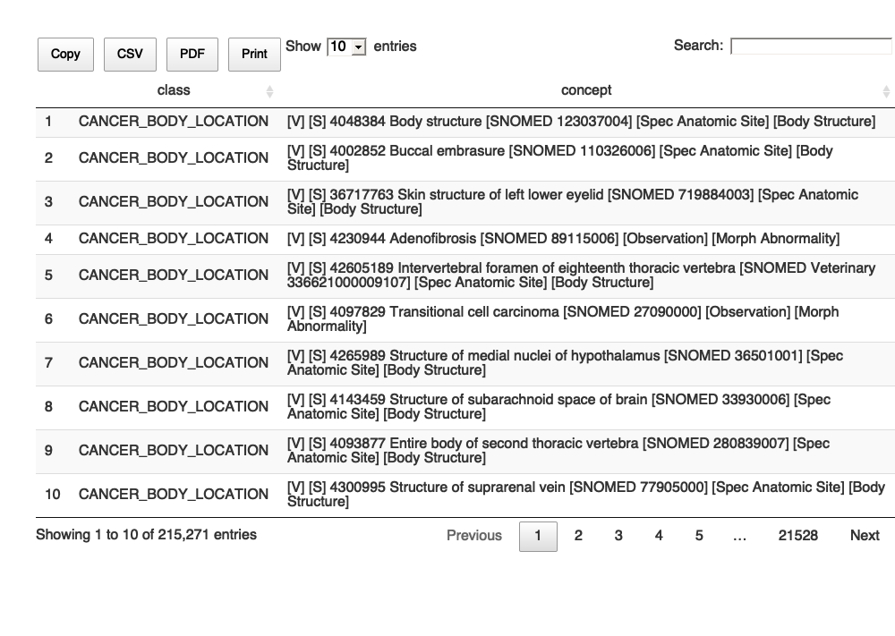

<!-- README.md is generated from README.Rmd. Please edit that file -->

# mOMOP

<!-- badges: start -->

[](https://www.tidyverse.org/lifecycle/#experimental)
[](https://CRAN.R-project.org/package=mOMOP)
<!-- badges: end -->

The goal of mOMOP is to crosswalk the [Minimal Common Oncology Data
Elements (mCode)](https://mcodeinitiative.org/) with the OMOP
Vocabularies. mCode and the mCode Initiative provides a common data
language and model for data exchange between entities while the OMOP
Vocabularies integrate data elements into the OMOP Common Data Model to
serve analytics use cases. A crosswalk using the terminology service
will bridge the gap between data interoperability and analytical
application.

## Installation

You can install mOMOP with:

``` r
library(devtools)
install_github("meerapatelmd/mOMOP")
```

## Examples

``` r
library(mOMOP)
```

## mCode Class Hierarchy

The end-product of this package is the `MCODE_CLASS_HIERARCHY` dataset,
which is a flattened taxonomy that serves a variety of use cases. For
example, it can be used to incorporate mCode into a lookup table in a
relational database such as the retrieval of a certain class of data
elements or it can be incorporated into an ontology.

``` r
rMarkedDown::print_dt(MCODE_CLASS_HIERARCHY)
#> Warning in instance$preRenderHook(instance): It seems your data is too big
#> for client-side DataTables. You may consider server-side processing: https://
#> rstudio.github.io/DT/server.html
```



## Crosswalks from mCode to OMOP

The crosswalk between mCode value sets and OMOP concepts used to create
the `MCODE_CLASS_HIERARCHY` dataset can be accessed with the following
pre-packaged dataframes: `CANCER_STAGING`, `GENOMICS`, `ICD10CM`,
`LOINC`, `SNOMED`, `SPECIMEN`, `UNITS_OF_MEASUREMENT`.

### Cancer Staging

``` r
head(CANCER_STAGING)
#>                   value_set_name              code_system
#> 1 TNMDistantMetastasesCategoryVS http://cancerstaging.org
#> 2 TNMDistantMetastasesCategoryVS http://cancerstaging.org
#> 3 TNMDistantMetastasesCategoryVS http://cancerstaging.org
#> 4 TNMDistantMetastasesCategoryVS http://cancerstaging.org
#> 5 TNMDistantMetastasesCategoryVS http://cancerstaging.org
#> 6 TNMDistantMetastasesCategoryVS http://cancerstaging.org
#>                                         logical_definition code
#> 1 includes codes from code system http://cancerstaging.org   NA
#> 2 includes codes from code system http://cancerstaging.org   NA
#> 3 includes codes from code system http://cancerstaging.org   NA
#> 4 includes codes from code system http://cancerstaging.org   NA
#> 5 includes codes from code system http://cancerstaging.org   NA
#> 6 includes codes from code system http://cancerstaging.org   NA
#>   code_description concept_id
#> 1               NA    1537692
#> 2               NA    1537780
#> 3               NA    1537798
#> 4               NA    1537804
#> 5               NA    1537805
#> 6               NA    1537808
#>                                                                                             concept_name
#> 1                                                 Vulvar Cancer cM1 TNM Finding by AJCC/UICC 8th edition
#> 2                                                Retinoblastoma cM0 TNM Finding by AJCC/UICC 8th edition
#> 3                                              Eyelid Carcinoma pM1 TNM Finding by AJCC/UICC 8th edition
#> 4 Uterine Corpus Leiomyosarcoma and Endometrial Stromal Sarcoma cM0 TNM Finding by AJCC/UICC 8th edition
#> 5                 Esophagus and Esophagogastric Junction Cancer cM1 TNM Finding by AJCC/UICC 8th edition
#> 6           Duodenum and Ampulla of Vater Neuroendocrine Tumor cM1c TNM Finding by AJCC/UICC 8th edition
#>     domain_id vocabulary_id concept_class_id standard_concept concept_code
#> 1 Measurement          NCIt    AJCC Category                S     cM1-50-8
#> 2 Measurement          NCIt    AJCC Category                S     cM0-68-8
#> 3 Measurement          NCIt    AJCC Category                S     pM1-64-8
#> 4 Measurement          NCIt    AJCC Category                S   cM0-54.1-8
#> 5 Measurement          NCIt    AJCC Category                S     cM1-16-8
#> 6 Measurement          NCIt    AJCC Category                S    cM1c-30-8
#>   valid_start_date valid_end_date invalid_reason
#> 1       2018-01-01     2099-12-31             NA
#> 2       2018-01-01     2099-12-31             NA
#> 3       2018-01-01     2099-12-31             NA
#> 4       2018-01-01     2099-12-31             NA
#> 5       2018-01-01     2099-12-31             NA
#> 6       2018-01-01     2099-12-31             NA
```

### Genomics

``` r
head(GENOMICS)
#>   value_set_name                     code_system
#> 1         HGNCVS http://www.genenames.org/geneId
#> 2         HGNCVS http://www.genenames.org/geneId
#> 3         HGNCVS http://www.genenames.org/geneId
#> 4         HGNCVS http://www.genenames.org/geneId
#> 5         HGNCVS http://www.genenames.org/geneId
#> 6         HGNCVS http://www.genenames.org/geneId
#>                             logical_definition code code_description concept_id
#> 1 All codes in http://www.genenames.org/geneId   NA               NA   35944910
#> 2 All codes in http://www.genenames.org/geneId   NA               NA   35944911
#> 3 All codes in http://www.genenames.org/geneId   NA               NA   35944912
#> 4 All codes in http://www.genenames.org/geneId   NA               NA   35944913
#> 5 All codes in http://www.genenames.org/geneId   NA               NA   35944914
#> 6 All codes in http://www.genenames.org/geneId   NA               NA   35944916
#>                                         concept_name   domain_id vocabulary_id
#> 1  CCDC77 (coiled-coil domain containing 77) Variant Measurement          HGNC
#> 2 INMT (indolethylamine N-methyltransferase) Variant Measurement          HGNC
#> 3           ZNF117 (zinc finger protein 117) Variant Measurement          HGNC
#> 4  CKAP2 (cytoskeleton associated protein 2) Variant Measurement          HGNC
#> 5                   ITPRIPL2 (ITPRIP like 2) Variant Measurement          HGNC
#> 6   PEX19 (peroxisomal biogenesis factor 19) Variant Measurement          HGNC
#>   concept_class_id standard_concept concept_code valid_start_date
#> 1             Gene                S        28203       2006-02-16
#> 2             Gene                S         6069       1999-09-07
#> 3             Gene                S        12897       1992-05-19
#> 4             Gene                S         1990       1999-12-01
#> 5             Gene                S        27257       2008-08-11
#> 6             Gene                S         9713       1997-06-12
#>   valid_end_date invalid_reason
#> 1     2099-12-31             NA
#> 2     2099-12-31             NA
#> 3     2099-12-31             NA
#> 4     2099-12-31             NA
#> 5     2099-12-31             NA
#> 6     2099-12-31             NA
```

### ICD-10-CM

``` r
head(ICD10CM)
#>     value_set_name code_system logical_definition  code
#> 1 CancerDisorderVS   ICD-10-CM                 NA C00.0
#> 2 CancerDisorderVS   ICD-10-CM                 NA C00.1
#> 3 CancerDisorderVS   ICD-10-CM                 NA C00.2
#> 4 CancerDisorderVS   ICD-10-CM                 NA C00.3
#> 5 CancerDisorderVS   ICD-10-CM                 NA C00.4
#> 6 CancerDisorderVS   ICD-10-CM                 NA C00.5
#>                                       code_description concept_id
#> 1             Malignant neoplasm of external upper lip   35206047
#> 2             Malignant neoplasm of external lower lip   35206048
#> 3      Malignant neoplasm of external lip, unspecified   35206049
#> 4        Malignant neoplasm of upper lip, inner aspect   35206050
#> 5        Malignant neoplasm of lower lip, inner aspect   35206051
#> 6 Malignant neoplasm of lip, unspecified, inner aspect   35206052
#>                                           concept_name domain_id vocabulary_id
#> 1             Malignant neoplasm of external upper lip Condition       ICD10CM
#> 2             Malignant neoplasm of external lower lip Condition       ICD10CM
#> 3      Malignant neoplasm of external lip, unspecified Condition       ICD10CM
#> 4        Malignant neoplasm of upper lip, inner aspect Condition       ICD10CM
#> 5        Malignant neoplasm of lower lip, inner aspect Condition       ICD10CM
#> 6 Malignant neoplasm of lip, unspecified, inner aspect Condition       ICD10CM
#>      concept_class_id standard_concept concept_code valid_start_date
#> 1 4-char billing code               NA        C00.0       2007-01-01
#> 2 4-char billing code               NA        C00.1       2007-01-01
#> 3 4-char billing code               NA        C00.2       2007-01-01
#> 4 4-char billing code               NA        C00.3       2007-01-01
#> 5 4-char billing code               NA        C00.4       2007-01-01
#> 6 4-char billing code               NA        C00.5       2007-01-01
#>   valid_end_date invalid_reason
#> 1     2099-12-31             NA
#> 2     2099-12-31             NA
#> 3     2099-12-31             NA
#> 4     2099-12-31             NA
#> 5     2099-12-31             NA
#> 6     2099-12-31             NA
```

### LOINC

``` r
head(LOINC)
#>      value_set_name code_system logical_definition    code
#> 1 TumorMarkerTestVS       LOINC                 NA  1695-6
#> 2 TumorMarkerTestVS       LOINC                 NA 31203-3
#> 3 TumorMarkerTestVS       LOINC                 NA  1692-3
#> 4 TumorMarkerTestVS       LOINC                 NA  1693-1
#> 5 TumorMarkerTestVS       LOINC                 NA  1694-9
#> 6 TumorMarkerTestVS       LOINC                 NA 72820-4
#>                                                       code_description
#> 1                  5-Hydroxyindoleacetate [Mass/time] in 24 hour Urine
#> 2                5-Hydroxyindoleacetate [Mass/volume] in 24 hour Urine
#> 3        5-Hydroxyindoleacetate [Mass/volume] in Cerebral spinal fluid
#> 4              5-Hydroxyindoleacetate [Mass/volume] in Serum or Plasma
#> 5                        5-Hydroxyindoleacetate [Mass/volume] in Urine
#> 6 5-Hydroxyindoleacetate [Mass/volume] in Urine by Confirmatory method
#>   concept_id
#> 1    3005148
#> 2    3023028
#> 3    3014670
#> 4    3021106
#> 5    3021385
#> 6   43055680
#>                                                           concept_name
#> 1                  5-Hydroxyindoleacetate [Mass/time] in 24 hour Urine
#> 2                5-Hydroxyindoleacetate [Mass/volume] in 24 hour Urine
#> 3        5-Hydroxyindoleacetate [Mass/volume] in Cerebral spinal fluid
#> 4              5-Hydroxyindoleacetate [Mass/volume] in Serum or Plasma
#> 5                        5-Hydroxyindoleacetate [Mass/volume] in Urine
#> 6 5-Hydroxyindoleacetate [Mass/volume] in Urine by Confirmatory method
#>     domain_id vocabulary_id concept_class_id standard_concept concept_code
#> 1 Measurement         LOINC         Lab Test                S       1695-6
#> 2 Measurement         LOINC         Lab Test                S      31203-3
#> 3 Measurement         LOINC         Lab Test                S       1692-3
#> 4 Measurement         LOINC         Lab Test                S       1693-1
#> 5 Measurement         LOINC         Lab Test                S       1694-9
#> 6 Measurement         LOINC         Lab Test                S      72820-4
#>   valid_start_date valid_end_date invalid_reason
#> 1       1970-01-01     2099-12-31             NA
#> 2       1970-01-01     2099-12-31             NA
#> 3       1970-01-01     2099-12-31             NA
#> 4       1970-01-01     2099-12-31             NA
#> 5       1970-01-01     2099-12-31             NA
#> 6       2012-12-10     2099-12-31             NA
```

### SNOMED

``` r
head(SNOMED)
#>         value_set_name code_system
#> 1 CancerBodyLocationVS   SNOMED CT
#> 2 CancerBodyLocationVS   SNOMED CT
#> 3 CancerBodyLocationVS   SNOMED CT
#> 4 CancerBodyLocationVS   SNOMED CT
#> 5 CancerBodyLocationVS   SNOMED CT
#> 6 CancerBodyLocationVS   SNOMED CT
#>                                          logical_definition ancestors_of
#> 1 includes codes descending from 123037004 | Body Structure           NA
#> 2 includes codes descending from 123037004 | Body Structure           NA
#> 3 includes codes descending from 123037004 | Body Structure           NA
#> 4 includes codes descending from 123037004 | Body Structure           NA
#> 5 includes codes descending from 123037004 | Body Structure           NA
#> 6 includes codes descending from 123037004 | Body Structure           NA
#>   descendants_of code code_description all_codes concept_id
#> 1      123037004   NA               NA 123037004    4048384
#> 2      123037004   NA               NA 123037004    4002852
#> 3      123037004   NA               NA 123037004   36717763
#> 4      123037004   NA               NA 123037004    4230944
#> 5      123037004   NA               NA 123037004   42605189
#> 6      123037004   NA               NA 123037004    4097829
#>                                             concept_name          domain_id
#> 1                                         Body structure Spec Anatomic Site
#> 2                                       Buccal embrasure Spec Anatomic Site
#> 3                    Skin structure of left lower eyelid Spec Anatomic Site
#> 4                                          Adenofibrosis        Observation
#> 5 Intervertebral foramen of eighteenth thoracic vertebra Spec Anatomic Site
#> 6                            Transitional cell carcinoma        Observation
#>       vocabulary_id  concept_class_id standard_concept    concept_code
#> 1            SNOMED    Body Structure                S       123037004
#> 2            SNOMED    Body Structure                S       110326006
#> 3            SNOMED    Body Structure                S       719884003
#> 4            SNOMED Morph Abnormality                S        89115006
#> 5 SNOMED Veterinary    Body Structure                S 336621000009107
#> 6            SNOMED Morph Abnormality                S        27090000
#>   valid_start_date valid_end_date invalid_reason
#> 1       1970-01-01     2099-12-31             NA
#> 2       1970-01-01     2099-12-31             NA
#> 3       2017-01-31     2099-12-31             NA
#> 4       1970-01-01     2099-12-31             NA
#> 5       2014-01-31     2099-12-31             NA
#> 6       1970-01-01     2099-12-31             NA
```

### Specimen

``` r
head(SPECIMEN)
#>   concept_id        value_set_name
#> 1    1027716 GeneticSpecimenTypeVS
#> 2    1032268 GeneticSpecimenTypeVS
#> 3    1033195 GeneticSpecimenTypeVS
#> 4    1033465 GeneticSpecimenTypeVS
#> 5    1033739 GeneticSpecimenTypeVS
#> 6    1585831 GeneticSpecimenTypeVS
#>                                     code_system logical_definition code
#> 1 http://terminology.hl7.org/CodeSystem/v2-0487                 NA  SKN
#> 2 http://terminology.hl7.org/CodeSystem/v2-0487                 NA  PLC
#> 3 http://terminology.hl7.org/CodeSystem/v2-0487                 NA  SAL
#> 4 http://terminology.hl7.org/CodeSystem/v2-0487                 NA  SPT
#> 5 http://terminology.hl7.org/CodeSystem/v2-0487                 NA  WND
#> 6 http://terminology.hl7.org/CodeSystem/v2-0487                 NA  BON
#>   code_description
#> 1             Skin
#> 2         Placenta
#> 3           Saliva
#> 4           Sputum
#> 5            Wound
#> 6             Bone
#>                                                                                                       Observation
#> 1                                             [V] [N] 1027716 Skin [LOINC LP36760-4] [Observation] [LOINC System]
#> 2                                          [V] [N] 1032268 Placenta [LOINC LP7477-5] [Observation] [LOINC System]
#> 3                                            [V] [N] 1033195 Saliva [LOINC LP7565-7] [Observation] [LOINC System]
#> 4                                            [V] [N] 1033465 Sputum [LOINC LP7600-2] [Observation] [LOINC System]
#> 5                                             [V] [N] 1033739 Wound [LOINC LP7726-5] [Observation] [LOINC System]
#> 6 [V] [N] 1585831 Organ Transplant Description: Bone [PPI OrganTransplantDescription_Bone] [Observation] [Answer]
#>   Condition Spec Anatomic Site Drug Meas Value Measurement Specimen X14
#> 1      <NA>               <NA> <NA>       <NA>        <NA>     <NA>  NA
#> 2      <NA>               <NA> <NA>       <NA>        <NA>     <NA>  NA
#> 3      <NA>               <NA> <NA>       <NA>        <NA>     <NA>  NA
#> 4      <NA>               <NA> <NA>       <NA>        <NA>     <NA>  NA
#> 5      <NA>               <NA> <NA>       <NA>        <NA>     <NA>  NA
#> 6      <NA>               <NA> <NA>       <NA>        <NA>     <NA>  NA
```

### Units of Measurement

``` r
head(UNITS_OF_MEASUREMENT)
#>    value_set_name               code_system logical_definition  code
#> 1 UnitsOfLengthVS http://unitsofmeasure.org                 NA    pm
#> 2 UnitsOfLengthVS http://unitsofmeasure.org                 NA    nm
#> 3 UnitsOfLengthVS http://unitsofmeasure.org                 NA    mm
#> 4 UnitsOfLengthVS http://unitsofmeasure.org                 NA    cm
#> 5 UnitsOfLengthVS http://unitsofmeasure.org                 NA     m
#> 6 UnitsOfLengthVS http://unitsofmeasure.org                 NA ft-us
#>   code_description concept_id concept_name domain_id vocabulary_id
#> 1        Picometer         NA         <NA>      <NA>          <NA>
#> 2        Nanometer         NA         <NA>      <NA>          <NA>
#> 3       Millimeter         NA         <NA>      <NA>          <NA>
#> 4       Centimeter         NA         <NA>      <NA>          <NA>
#> 5            Meter         NA         <NA>      <NA>          <NA>
#> 6             Foot         NA         <NA>      <NA>          <NA>
#>   concept_class_id standard_concept concept_code valid_start_date
#> 1             <NA>             <NA>         <NA>             <NA>
#> 2             <NA>             <NA>         <NA>             <NA>
#> 3             <NA>             <NA>         <NA>             <NA>
#> 4             <NA>             <NA>         <NA>             <NA>
#> 5             <NA>             <NA>         <NA>             <NA>
#> 6             <NA>             <NA>         <NA>             <NA>
#>   valid_end_date invalid_reason
#> 1           <NA>           <NA>
#> 2           <NA>           <NA>
#> 3           <NA>           <NA>
#> 4           <NA>           <NA>
#> 5           <NA>           <NA>
#> 6           <NA>           <NA>
```

## Code of Conduct

Please note that the mOMOP project is released with a [Contributor Code
of
Conduct](https://contributor-covenant.org/version/2/0/CODE_OF_CONDUCT.html).
By contributing to this project, you agree to abide by its terms.
